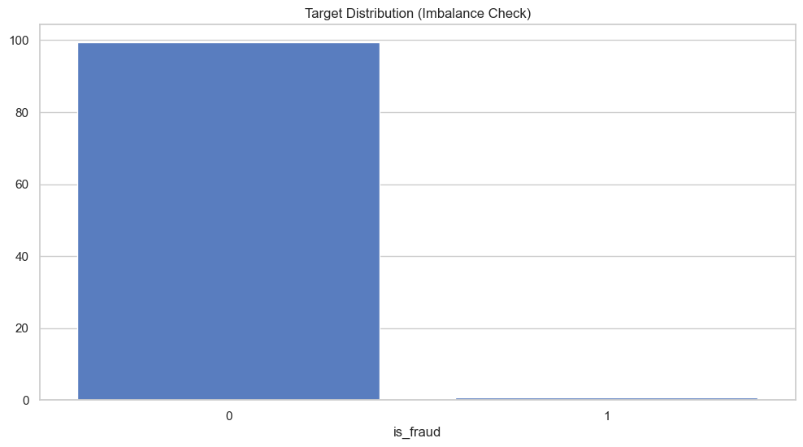
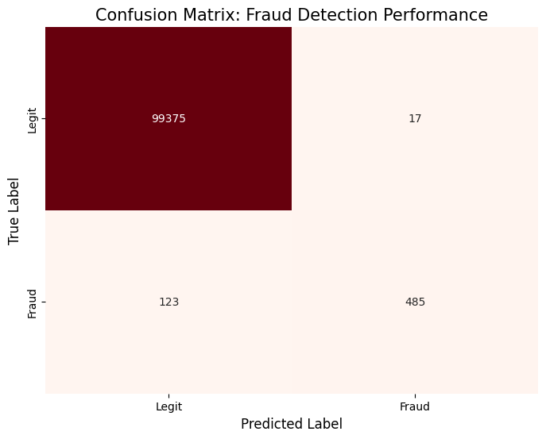
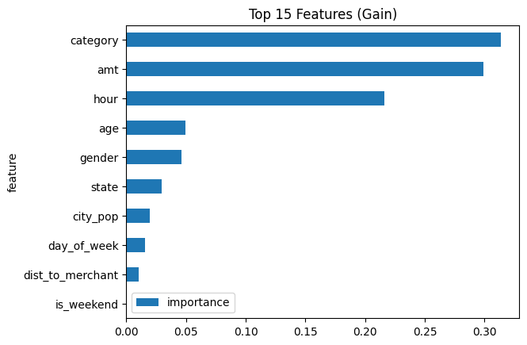

<p align="center">
  
</p>


# Key findings: 

**Key findings: Transactions within high-risk categories such as online shopping and groceries, as well as those occurring during late-night hours (22:00–03:00), were significantly more likely to be fraudulent.**


## Author

- [@coder-red](https://www.github.com/coder-red)

## Table of Contents

  - [Business context](#business-context)
  - [Data source](#data-source)
  - [Methods](#methods)
  - [Tech Stack](#tech-stack)
  - [Quick Start](#quick-start)
  - [Quick glance at the results](#quick-glance-at-the-results)
  - [Lessons learned and recommendation](#lessons-learned-and-recommendation)
  - [Limitation and what can be improved](#limitation-and-what-can-be-improved)
  - [Repository structure](#repository-structure)
  - [Agentic Decision Pipeline](#agentic-decision-pipeline)


## Business context
This model identifies fraudulent credit card transactions in real time by combining XGBoost machine learning with an Agentic LLM investigator. Risk operations teams and fintech institutions use this to automate high volume triage, reduce financial loss from chargebacks, and provide a human-in-the-loop layer for investigative decisions

## Data source

- https://www.kaggle.com/datasets/kartik2112/fraud-detection

## Methods

- **Two Step Security System:** Built a dual engine decision system that uses XGBoost model to scan every transaction and provide a probability scoring, integrated with LangGraph for behavioural investigation on suspicious cases.

- **Behavioural Feature engineering:** Engineered features prioritizing transaction Category, geographical location and Temporal Density (Hour/Day), identifying late-night (22:00–03:00) as primary fraud signals.

- **Agentic Reasoning & HITL:** Developed an asynchronous Human-In-The-Loop (HITL) workflow where the LLM agent analyzes suspicious patterns and pauses execution to request a manual verdict for high risk cases.

- **Fast & Reliable Connection:**  Used FastAPI to build a quick connection between the math model and the AI agent. I also added a health check system that makes sure the server is fully awake and ready before sending any data, preventing errors or lost information.


## Tech Stack

- **Python**(refer to requirements.txt for the packages used in this project)
- **Scikit-learn and XGBoost** (machine learning, classification, and feature importance evaluation)
- **FastAPI** (high speed inference engine used to serve model predictions to the agentic layer)
- **LangGraph and LangChain** (orchestration of agentic reasoning, state management, and HITL transitions)
- **Groq** (LLM inference provider used for behavioral reasoning and investigation)

## Quick Start

Follow these steps to launch the API and run the agentic simulation on your local machine.

---

**1. Prerequisites**

- Python 3.10+
- Groq API Key: Get one at groq.com.
- uv: Install via `curl -LsSf https://astral.sh/uv/install.sh | sh` (macOS/Linux) or `powershell -c "irm https://astral.sh/uv/install.ps1 | iex"` (Windows).

**2. Setup & Installation**
Clone the repo and initialize the environment. uv will automatically read the pyproject.toml and create a virtual environment for you.

**Bash**

```bash
git clone https://github.com/coder-red/live-fraud-detection-agent/

# Add your API key to the environment
echo "GROQ_API_KEY=your_key_here" > .env

# Synchronize dependencies and create the virtual environment
uv sync
```
**3. Run the Simulation**
Launch the orchestration script. This starts the FastAPI inference server, waits for the health check to pass, and begins the Agentic Simulation.

```bash
# Run the full pipeline
uv run run_all.py
```


## Quick glance at the results

Target distribution between the features.



Confusion matrix.



Feature importance.



- ***Key Metrics: F1-Score, Precision, Recall***


### Model Evaluation Strategy

**Primary Metric: F1-Score**
Fraud detection requires a balance between security and customer experience. Hence, the F1-Score is the primary metric used as it penalizes models that either miss too much fraud or annoy too many legitimate customers with false alarms. 

**Supporting Metrics: Recall, Precision and Confusion matrix**
- **Recall:** Measures the model's ability to capture as much fraud as possible.
- **Precision:** Measures how often a flagged transaction is actually fraudulent.
-**Confusion Matrix:** Used to visualize the trade offs between False Positives and False Negatives 

## Lessons Learned and Recommendations

**What I found:**

- **Dual-Engine vs. Single Model Performance:** While XGBoost is efficient at scoring bulk transactions, adding the LangGraph AI agent was better for the grey area cases due to context aware reasoning.

- **Mid Nights are High Risk** There was extreme concentration of fraudlent activity during late hours (22:00 - 03:00) across all days of the week. This made time of day one of the most important signals

- **Weekends showed no value:** Interestingly, `is_weekend` had zero importance in the model's decision making process. The data indicates that fraud follows an hourly cycle rather than a day of the week cycle, which made specific time stamps more critical than the calendar day.

- **The transaction category mattered most:** The merchant category was the strongest predictor of fraud, with `shopping_net`, `misc_net` and `grocery_pos` showing fraud rates significantly higher than the baseline average. This confirms that fraudsters tend to prioritize specific merchant types.


**Recommendation:**
- Recommendation would be to regularly retrain the model on updated transaction data to adapt to evolving fraud tactics.

## Limitation and What Can Be Improved
**Limitation**
- The model relies heavily on historical risk levels for specific merchant categories. If a new category of merchant emerges or a fraudster switches to a previously safe category, the system may require a full retraining cycle to recognize the new pattern.


**What Can Be Improved**
- Dynamic Re-training Pipeline: Implement an automated sliding-window pipeline to re-train the XGBoost model daily.This would allow the system to adapt to the phases where fraudster behaviors change 

## Repository structure

<details>
  <summary><strong>Repository Structure (click to expand)</strong></summary>

```text

Live-Fraud-Agent/
├── README.md                    # Demo GIF + docker-compose up instructions
├── requirements.txt
├── .env.example
├── docker-compose.yml          # API + DB one-command demo
├── Dockerfile
│
├── app/                        # FastAPI production API
│   ├── main.py
│   └── routes.py
│
├── agents/                     # RAG agentic fraud reasoning
│   ├── fraud_agent.py         # LLM decision layer
│   ├── prompts.py
│   └── tools.py
│
├── src/                        # ML pipeline
│   ├── inference.py           # XGBoost 
│   ├── features.py
│   └── data.py
│
├── notebooks/                  # Proof of work
│   ├── 01_eda.ipynb
│   └── 02_training.ipynb
│
├── tests/                      # Production reliability
│   └── test_end_to_end.py
├── data/                       # Sample transactions
│   └── sample_fraud.csv
└── models/
    └── xgboost_fraud.pkl

```

</details>

## Agentic Decision Pipeline
<details>
  <summary><strong>Agentic Decision Pipeline (click to expand)</strong></summary>


```text


Transaction → API Call → AI Reasoning → Decision
                                            ↓
                                     Is it BLOCK?
                                     ↙          ↘
                                  YES           NO
                                   ↓            ↓
                             Ask Human        Auto-approve
                               (HITL)            (Done)
```