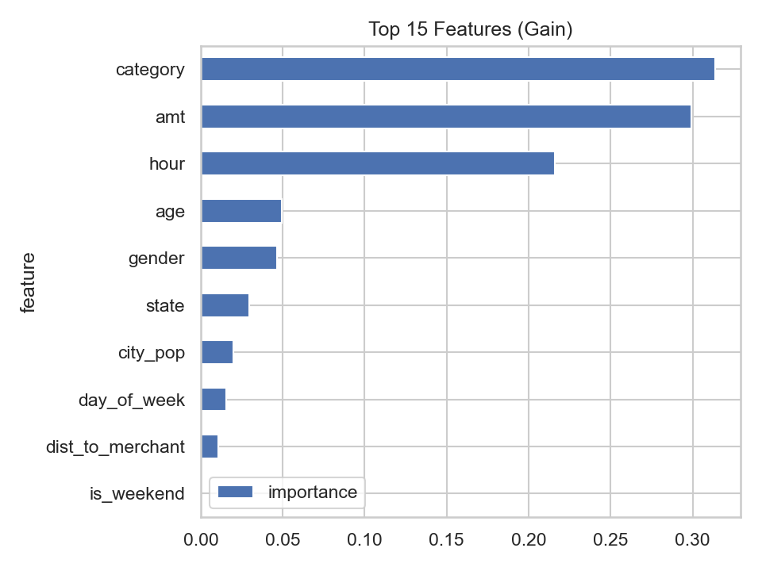
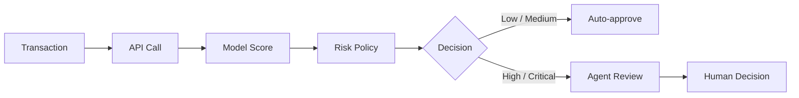

<p align="center">
  
</p>


# Key findings:

Transactions within high-risk categories such as online shopping and groceries, as well as those occurring during late-night hours (22:00-03:00) were significantly more likely to be fraudulent.


## Author

- [@coder-red](https://www.github.com/coder-red)

## Table of Contents

  - [Business context](#business-context)
  - [Data source](#data-source)
  - [Methods](#methods)
  - [Tech Stack](#tech-stack)
  - [Quick Start](#quick-start)
  - [System flow](#system-flow)
  - [Why Redis is here](#why-redis-is-here)
  - [Review flow](#review-flow)
  - [Quick glance at the results](#quick-glance-at-the-results)
  - [Lessons learned and recommendation](#lessons-learned-and-recommendation)
  - [Limitation and what can be improved](#limitation-and-what-can-be-improved)
  - [Repository structure](#repository-structure)
  - [Agentic Decision Pipeline](#agentic-decision-pipeline)
  - [Additional Docs](#additional-docs)


## Business context
This project identifies fraudulent credit card transactions in real time by combining XGBoost machine learning with an agentic LLM investigator. It is a full workflow that scores transactions through an API, applies a business risk policy, stores prediction history, opens review cases for suspicious activity, and lets a human reviewer make the final call when needed.

Risk operations teams and fintech institutions can use a system like this to automate high-volume triage, reduce financial loss from chargebacks, and keep a human-in-the-loop layer for higher-risk decisions.

## Data source

- https://www.kaggle.com/datasets/kartik2112/fraud-detection

## Methods

- **Two Step Security System:** Built a dual-engine decision flow where XGBoost scores every transaction first, then a policy layer decides whether to approve, review, or block it. Suspicious cases get passed into an LLM-based review step for extra investigation.

- **Behavioural Feature engineering:** Engineered features around transaction category, geographical location, and temporal density (hour/day), with late-night activity (22:00-03:00) showing up as one of the strongest fraud signals.

- **Agentic Reasoning & HITL:** Built an asynchronous Human-In-The-Loop (HITL) workflow where the LLM agent explains suspicious patterns, generates reviewer-facing reasoning, and supports a manual verdict flow for high-risk cases.

- **Fast, Stateful Backend:** Used FastAPI to expose the scoring flow as a real API, added PostgreSQL persistence for predictions and fraud cases, and used Redis for request deduplication and sliding-window rate limiting so the system behaves more like a real production service.

- **Reviewer Console:** Added a Streamlit dashboard to simulate a lightweight fraud-ops console where pending cases, transaction details, model outputs, and human decisions can all be viewed in one place.


## Tech Stack

- **Python** (refer to `pyproject.toml` for the main packages used in this project)
- **Scikit-learn and XGBoost** (machine learning, classification, and feature importance evaluation)
- **FastAPI** (real-time inference API and review endpoints)
- **LangGraph and LangChain** (orchestration of agentic reasoning, state management, and HITL transitions)
- **Groq** (LLM inference provider used for behavioural reasoning and investigation)
- **PostgreSQL and SQLAlchemy** (prediction persistence, fraud case storage, and reviewer history)
- **Redis** (request deduplication and sliding-window rate limiting)
- **Streamlit** (review dashboard for pending fraud cases)
- **Docker Compose** (local multi-service setup for API, Postgres, Redis, and pgAdmin)

## Quick Start

Follow these steps to launch the API, run the full simulation, and inspect the review workflow on your local machine.

---

**1. Prerequisites**

- Python 3.11+
- Groq API Key: Get one at groq.com.
- uv: Install via `curl -LsSf https://astral.sh/uv/install.sh | sh` (macOS/Linux) or `powershell -c "irm https://astral.sh/uv/install.ps1 | iex"` (Windows).

**2. Setup & Installation**
Clone the repo and initialize the environment. Copy the example environment file first so your local secrets stay out of Git.

**Bash**

```bash
git clone https://github.com/coder-red/live-fraud-detection-agent/

# Copy the sample environment and fill in your real values
cp .env.example .env

# Synchronize dependencies and create the virtual environment
uv sync
```

If you're on Windows PowerShell:

```powershell
Copy-Item .env.example .env
```

Then update `.env` with the values you want to use.

- `GROQ_API_KEY` powers the LLM review path
- `REDIS_URL` powers deduplication and rate limiting
- `POSTGRES_*` values are used by Docker Compose to build the database connection

If `GROQ_API_KEY` is missing, the app still works and falls back to deterministic review text.

**3. Run the API Only**
If you just want the API and Swagger UI:

```bash
uv run uvicorn app.main:app --reload
```

Then open:

- Swagger UI: `http://127.0.0.1:8000/docs`
- Health check: `http://127.0.0.1:8000/`

**4. Run the Docker Stack**
The default Compose stack starts `api`, `postgres`, and `redis`.

```bash
docker compose up --build
```

To start pgAdmin too:

```bash
docker compose --profile devtools up --build
```

**5. Run the Review Dashboard**
If you want the reviewer console:

```bash
uv run streamlit run dashboard.py
```

**6. Run Tests**
Run the automated test suite:

```bash
uv run pytest tests
```

If you want to manually see the rate limiter return a `429`, use the smoke test script while the API is running:

```bash
uv run python scripts/test_rate_limit.py
```

## System flow

This is the backend flow the app follows:

1. A transaction hits `POST /api/v1/predict`
2. Redis checks for spammy request volume through a sliding-window rate limiter
3. The request is fingerprinted so duplicate transactions can be reused instead of scored again
4. XGBoost scores the transaction
5. A risk policy converts the score into `APPROVE`, `REVIEW`, or `BLOCK`
6. Predictions and review cases are stored in Postgres
7. High-risk cases can be reviewed by the agent and then resolved by a human

## Review flow

This is the part that makes the system more useful than a plain fraud score.

- Low-risk transactions can pass automatically.
- Higher-risk transactions can be saved as review cases instead of just returning a score and disappearing.
- The agent adds reasoning, reason codes, and reviewer questions to help explain why the case looks suspicious.
- A human reviewer can still make the final call when the case needs judgment instead of pure automation.


## Quick glance at the results

I kept the results section short on purpose because this repo is more about the full AI workflow than just the training notebook.

- **What mattered most:** merchant category, night-time activity, and geography-based behaviour
- **Model goal:** catch fraud without creating too much reviewer noise
- **Decision layer:** raw model output is converted into `APPROVE`, `REVIEW`, or `BLOCK` through a risk policy instead of exposing probability alone

If you want the deeper EDA/training side, check the notebooks and plots in `notebooks/` and `assets/`.



## Lessons Learned and Recommendations

**What I found:**

- **Dual-Engine vs. Single Model Performance:** While XGBoost is efficient at scoring bulk transactions, adding the LangGraph AI agent was better for the grey-area cases because it adds context-aware reasoning on top of the raw score.

- **Mid Nights are High Risk:** There was extreme concentration of fraudulent activity during late hours (22:00 - 03:00) across all days of the week. This made time of day one of the most important signals.

- **Weekends showed no value:** Interestingly, `is_weekend` had zero importance in the model's decision-making process. The data suggests fraud followed an hourly cycle more than a day-of-week cycle, which made specific time signals more useful than the calendar day itself.

- **The transaction category mattered most:** The merchant category was the strongest predictor of fraud, with `shopping_net`, `misc_net` and `grocery_pos` showing fraud rates significantly higher than the baseline average. This confirms that fraudsters tend to prioritize specific merchant types.

**Recommendation:**
- Regularly retrain the model on updated transaction data so the system can adapt as fraud patterns change.

## Limitation and What Can Be Improved

**Limitation**
- The model relies heavily on historical risk levels for specific merchant categories. If a new category of merchant emerges or a fraudster switches to a previously safe category, the system may require a full retraining cycle to recognize the new pattern.
- The current app is still a local-first system. It does not yet include authentication, database migrations, or a full production deployment layer.

**What Can Be Improved**
- Dynamic Re-training Pipeline: Implement an automated sliding-window pipeline to re-train the XGBoost model daily. This would help the system adapt to phases where fraudster behaviour changes.
- Add authentication and reviewer roles for case-management endpoints.
- Replace `create_all()` with proper database migrations.
- Add monitoring, drift tracking, and deployment hardening.

## Repository structure

<details>
  <summary><strong>Repository Structure (click to expand)</strong></summary>

```text
.
|-- Dockerfile
|-- README.md
|-- agents
|   |-- fraud_agents.py
|   `-- tools.py
|-- app
|   |-- __init__.py
|   |-- db
|   |   |-- __init__.py
|   |   |-- connections.py
|   |   `-- models.py
|   |-- main.py
|   `-- routes.py
|-- assets
|   |-- FRAUD.png
|   |-- confusion.png
|   |-- features.png
|   `-- target.png
|-- config.py
|-- dashboard.py
|-- data
|   `-- sample_transactions.csv
|-- docker-compose.yml
|-- docs
|   |-- API.md
|   `-- ROADMAP.md
|-- model
|   |-- feature_list.pkl
|   `-- fraud_model.json
|-- notebooks
|   |-- 01_eda.ipynb
|   `-- 02_training.ipynb
|-- pyproject.toml
|-- requirements-dev.txt
|-- requirements.txt
|-- scripts
|   |-- generate_sample_transactions.py
|   `-- test_rate_limit.py
|-- src
|   |-- __init__.py
|   |-- agent_review.py
|   |-- features.py
|   |-- inference.py
|   |-- policy.py
|   `-- transaction_generator.py
|-- tests
|   |-- test_agent_review.py
|   |-- test_api.py
|   |-- test_features.py
|   `-- test_policy.py
`-- uv.lock
```

</details>

## Agentic Decision Pipeline

<details>
  <summary><strong>Agentic Decision Pipeline (click to expand)</strong></summary>


```mermaid
flowchart LR
    A[Transaction] --> B[API Call]
    B --> C[Model Score]
    C --> D[Risk Policy]
    D --> E{Decision}
    E -->|Low / Medium| F[Auto-approve]
    E -->|High / Critical| G[Agent Review]
    G --> H[Human Decision]
```

</details>

## Additional Docs

- [API Reference](docs/API.md)
- [Roadmap](docs/ROADMAP.md)
